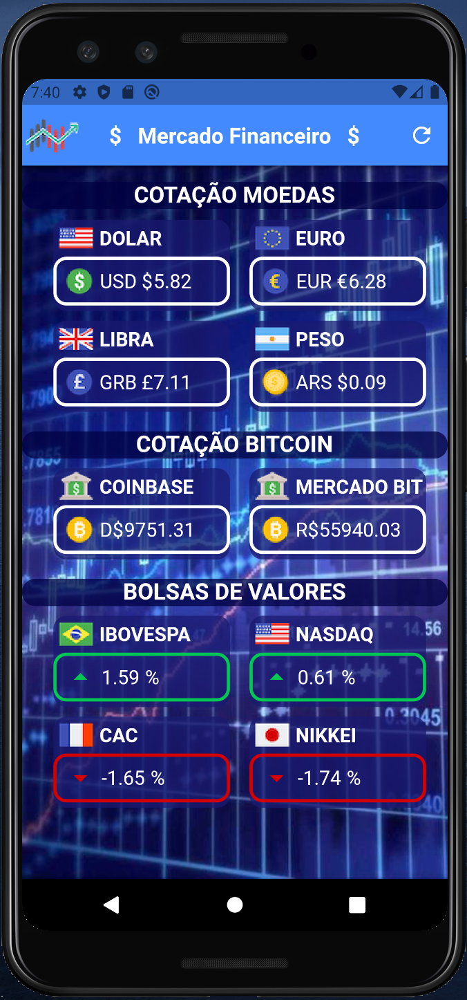

# Mercado Financeiro

Aplicativo que mostra a cotação das moedas: Dolar(USD), Euro(EUR), Libra(GRB), Peso(ARS), Bitcoin(Coinbase e MercadoBitcoin).
E das bolsas: IBOVESPA(BRA), NASDAQ(USA), CAC(FRA), NIKKEI(JAP).

Atualizado em tempo real pela API do site [HG-Brasil](https://hgbrasil.com/finance)

## Getting Started

Para obter ajuda sobre como iniciar o Flutter, consulte nossa [documentação](https://flutter.io/) on-line .

## Screenshots

| Main Screen |
| --------|
||

